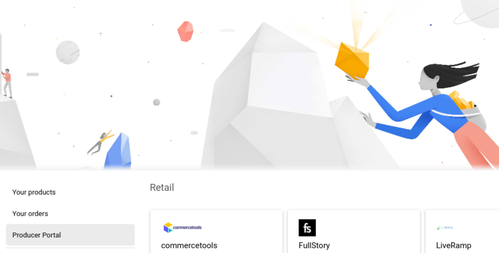
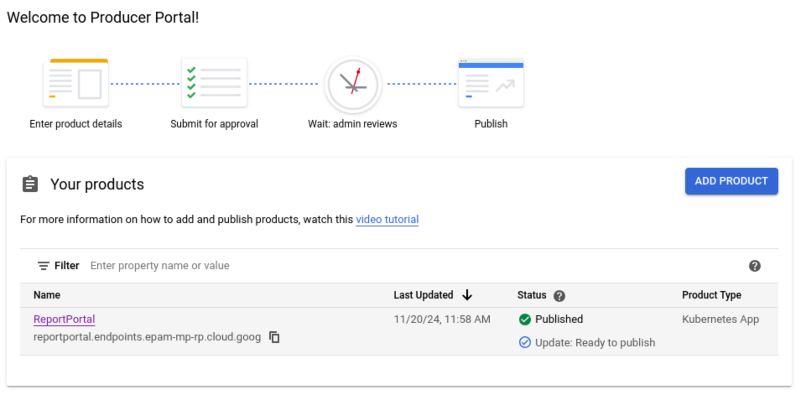
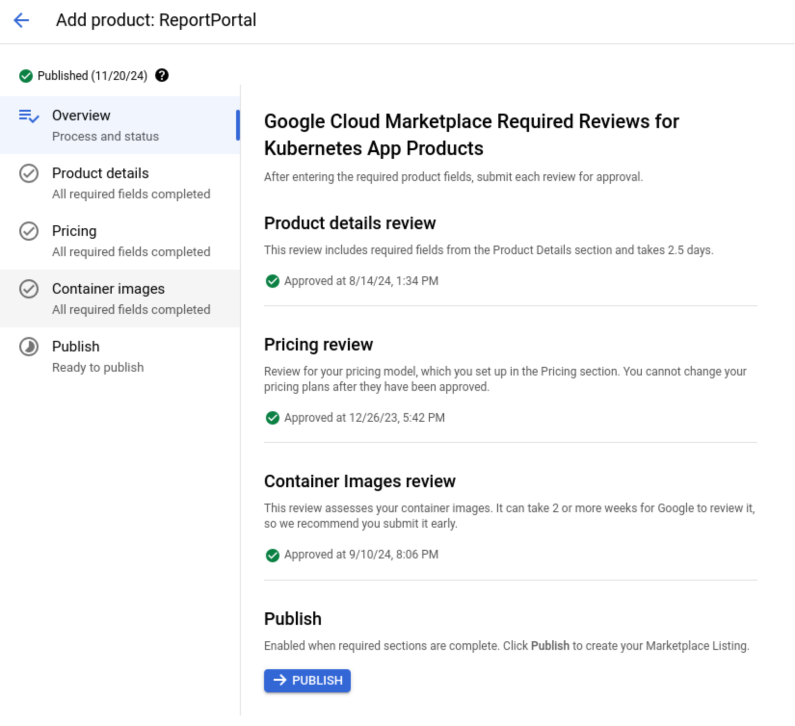
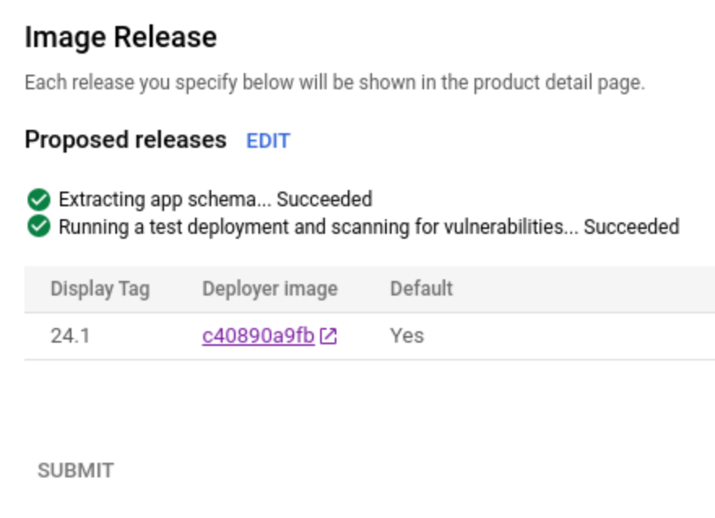
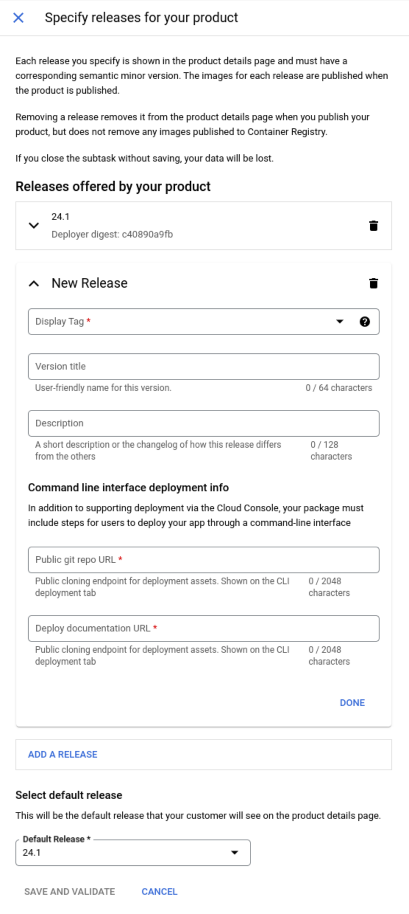
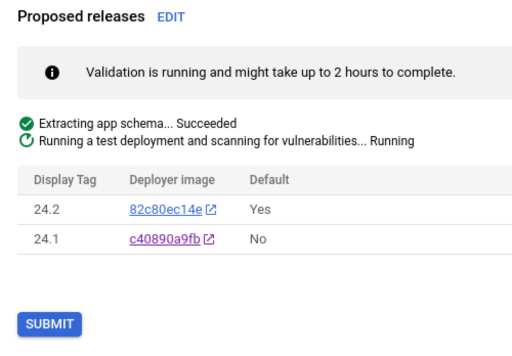

# Release a new ReportPortal version

This guide describes how to add a new version of ReportPortal on
Google Cloud Platform (GCP) Marketplace.

## Prerequisites

For this guide, you need the following:

- [kubectl](https://kubernetes.io/docs/tasks/tools/install-kubectl/) - Kubernetes command-line tool
- [helm](https://helm.sh/docs/intro/install/) - Helm command-line tool
- [gcloud](https://cloud.google.com/sdk/gcloud/) - Google Cloud SDK
- [gcloud gke auth plugin](https://cloud.google.com/kubernetes-engine/docs/how-to/cluster-access-for-kubectl#install_plugin) - Google Cloud SDK Kubernetes Engine plugin
- [mpdev](https://github.com/GoogleCloudPlatform/marketplace-k8s-app-tools/blob/master/docs/mpdev-references.md#overview-and-setup) - Google Cloud Marketplace development tool
- [yq](https://github.com/mikefarah/yq/?tab=readme-ov-file#install) - YAML processor for parsing Chart.yaml
- [crane](https://github.com/google/go-containerregistry/blob/main/cmd/crane/README.md) - tool for interacting with remote images and registries.

### Configure Google Cloud CLI

```bash
gcloud init
gcloud auth configure-docker
```

### Configure Marketplace development tool

Create a new directory for the mpdev tool:

```bash
mkdir -p "$HOME/.local/bin"
```

Add the directory to the PATH:

```bash
export PATH="$PATH:$HOME/.local/bin"
```

Install the mpdev tool:

```bash
BIN_FILE="$HOME/.local/bin/mpdev"
docker run \
  gcr.io/cloud-marketplace-tools/k8s/dev \
  cat /scripts/dev > "$BIN_FILE"
chmod +x "$BIN_FILE"
```

### Update Chart.yaml versions

In the `data/chart/reportportal-k8s-app/Chart.yaml` file, update the `version` and `appVersion` fields:

```yaml
appVersion: "24.2"
version: &version 24.2.1
```

The `appVersion` will be used as a release track version in the Marketplace.

The `version` has to relate to the main ReportPortal Helm chart version.

Check if your changes are valid:

```bash
make info
```

### Create and push a new deployer image

Create a new deployer image with the updated version:

```bash
make deploy
```

After deploy verify that the image pushed successfully:

```bash
gcloud container images list-tags gcr.io/epam-mp-rp/reportportal/deployer
```

### Upload the Chart images

You need to upload the images to the Google Cloud Artifact Registry:

```bash
make deploy-deps
```

After the images are uploaded, verify that they are available:

```bash
gcloud container images list-tags gcr.io/epam-mp-rp/reportportal/reportportal-index
gcloud container images list-tags gcr.io/epam-mp-rp/reportportal/reportportal-ui
gcloud container images list-tags gcr.io/epam-mp-rp/reportportal/reportportal-api
gcloud container images list-tags gcr.io/epam-mp-rp/reportportal/reportportal-uat
gcloud container images list-tags gcr.io/epam-mp-rp/reportportal/reportportal-jobs
gcloud container images list-tags gcr.io/epam-mp-rp/reportportal/reportportal-analyzer
gcloud container images list-tags gcr.io/epam-mp-rp/reportportal/reportportal-migrations
gcloud container images list-tags gcr.io/epam-mp-rp/reportportal/reportportal-metricsgatherer
gcloud container images list-tags gcr.io/epam-mp-rp/reportportal/rabbitmq3
gcloud container images list-tags gcr.io/epam-mp-rp/reportportal/postgresql16
gcloud container images list-tags gcr.io/epam-mp-rp/reportportal/opensearch2
gcloud container images list-tags gcr.io/epam-mp-rp/reportportal/minio2024
gcloud container images list-tags gcr.io/epam-mp-rp/reportportal/k8s-wait-for
```

### Create a test cluster

```bash
make test-cluster
```

Check if the cluster is ready:

```bash
kubectl get nodes
```

### Verify

```bash
make verify
```

You have to see the following output to proceed:

```bash
=== VERIFICATION STATUS ===
PASSED
===========================
```

### Delete cluster and disks

```bash
make clean
```

### Release

After you get the successful verification, you can release the new version.

Got to the [Google Marketplace Producer Portal](https://console.cloud.google.com/producer-portal/overview).



Select the ReportPortal product.



Select the `Container images` tab.



On the `Container images` tab, click the `Edit` button into the `Proposed releases` section.



Click the `Add a release` button.
Select a `Display tag` from a tag list.
Fill other fields and select a `Default release`.
Click the `Save and Validate` button.



Submit the release after all validations are passed.



After it you need to wait for a Google team to approve the release and then you can publish it.
